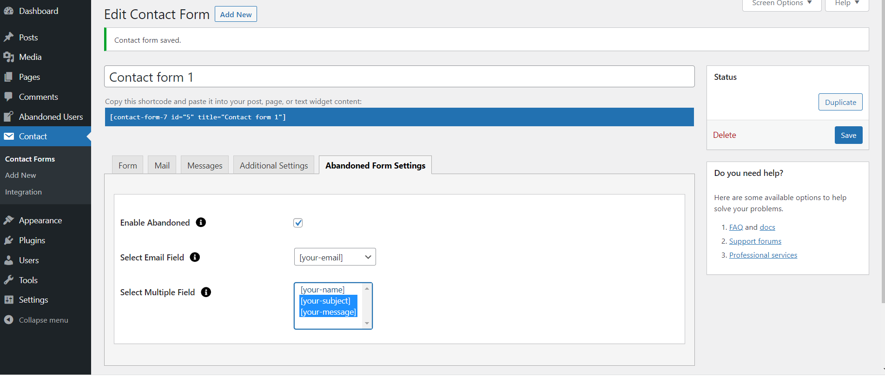
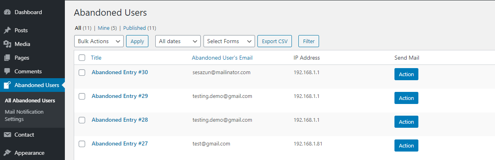
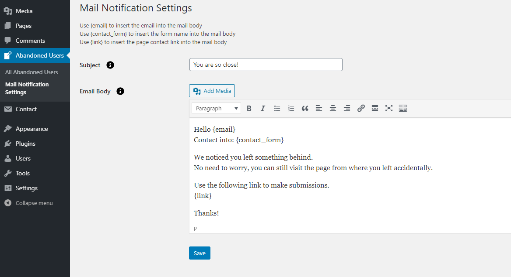
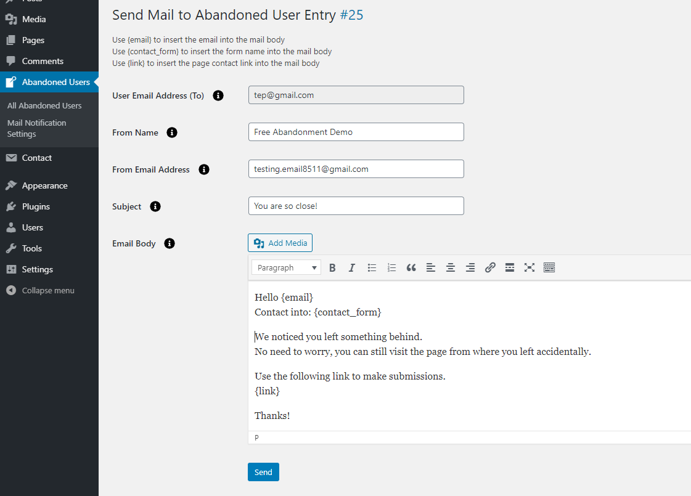
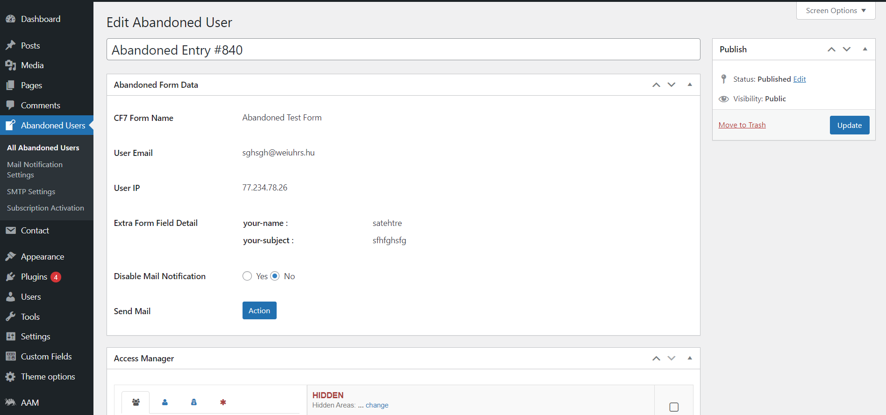
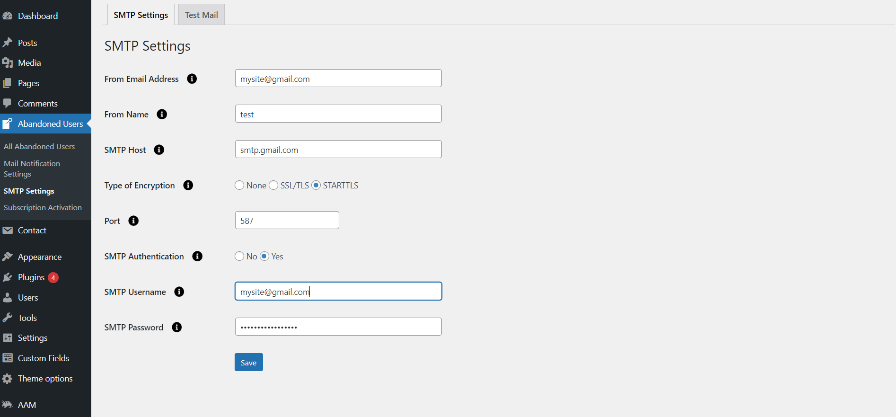
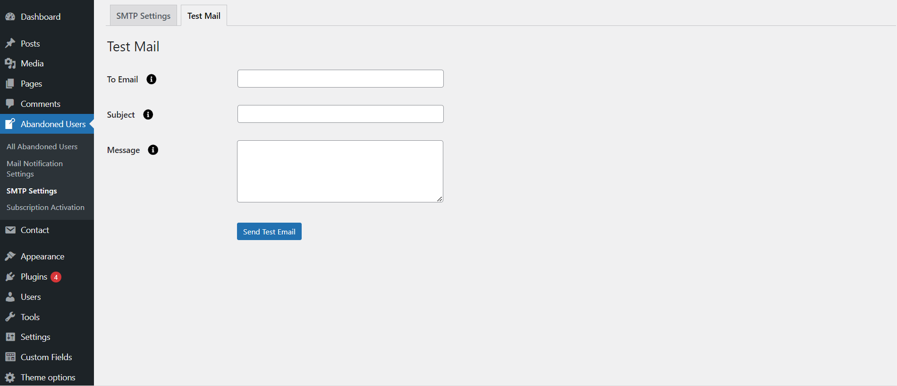

# Abandoned Contact Form 7
Abandoned Contact Form 7 plugin provides to track the Contact Form 7 form data even if the user does not submit the form. And, sends mail notification to each Abandoned user.

**Features of Abandoned Contact Form 7**

- Select your email ID field for Form in the form settings.
- Enable/Disable Option for multiple forms where you need in Contact Form 7.
- View the list of entries in the Admin side for Abandoned submission.
- In the list of Abandoned forms entry in admin side you can view IP addresses and other data which are filled-up by the user.
- Provision to send an email to a single user that abandoned the form.
- Facility to export the list of entire abandoned users to CSV.
- Also, an option to customize the mail body for Abandoned email.
- Select specific field to include in tracking data.
- Compatibility of WordPress VIP.

[Demo for Abandoned Contact Form 7](https://demo.zealousweb.com/wordpress-plugins/abandoned-contact-form-7/)

**Features of Abandoned Contact Form 7 Pro**

We have released the PRO version of this plugin with extra advantageous features added. PRO Version 1.0 Released.

- Custom Webhook URL Support - Send abandoned form data to any external endpoint of your choice for seamless third-party integration.
- Added New Analytics Dashboard.
- Add - Admin Email Notification Settings.
- Compatibility of WordPress VIP.
- Select your email ID field for Form in the form settings.
- Enable/Disable Option for multiple forms where you need in Contact Form 7.
- View the list of entries in the Admin side for abandoned submissions.
- In the list of Abandoned forms entry in admin side you can view IP addresses and other data which are filled-up by the user unlimited Entries.
- Facility to export the list of entire abandoned users unlimited Entries.
- You can schedule a time for sending emails to each abandoned user.
- You can set the “Status” of the user to send an email so we can manage not to send the same email again to the same user.
- You can easily manage the number of times emails sent to the user.
- Also, An option to customize the mail body for Abandoned email unlimited Entries.
- For schedule mails, we have the option of SMTP settings. Here, you can set SMTP from Plugin, no need to add another plugin for SMTP configuration.
- Our plugin also supports in Multinetwork site.
- Here you can select the specific field to include in tracking data.
- Provision to send an email to a single user who abandoned the form.

[Get more information about the Pro version](https://store.zealousweb.com/abandoned-contact-form-7-pro)

[Demo for Abandoned Contact Form 7 Pro](https://demo.zealousweb.com/wordpress-plugins/abandoned-contact-form-7-pro/)

**OUR OTHER PLUGINS**

* <strong>[Accept PayPal Payments Using Contact Form 7 Pro](https://store.zealousweb.com/accept-paypal-payments-using-contact-form-7-pro)</strong>
* <strong>[Accept Stripe Payments Using Contact Form 7 Pro](https://store.zealousweb.com/accept-stripe-payments-using-contact-form-7-pro)</strong>
* <strong>[Accept Authorize.NET Payments Using Contact Form 7 Pro](https://store.zealousweb.com/accept-authorize-net-payments-using-contact-form-7-pro)</strong>
* <strong>[Accept 2Checkout Payments Using Contact Form 7 Pro](https://store.zealousweb.com/accept-2checkout-payments-using-contact-form-7-pro)</strong>
* <strong>[Accept Sage Pay Payments Using Contact Form 7 Pro](https://store.zealousweb.com/accept-sage-pay-opayo-payments-using-contact-form-7-pro)</strong>
* <strong>[User Registration Using Contact Form 7 Pro](https://store.zealousweb.com/user-registration-using-contact-form-7-pro)</strong>
* <strong>[Abandoned Contact Form 7 Pro](https://store.zealousweb.com/abandoned-contact-form-7-pro)</strong>

# Installation
1. Download the plugin zip file from WordPress.org plugin site to your desktop / PC
2. If the file is downloaded as a zip archive, extract the plugin folder to your desktop.
3. With your FTP program, upload the plugin folder to the wp-content/plugins folder in your WordPress directory online
4. Go to the Plugin screen and find the newly uploaded Plugin in the list.
5. Click ‘Activate Plugin’ to activate it.

# How To Use

Contact Form 7 must be installed and active before using this plugin.

## Free plugin setup

1. Go to **Contact → Contact Forms** and edit a form.
2. Open the **Abandoned Form Settings** tab to enable tracking, choose the email field, and select which fields to store.

3. Go to **Abandoned Users** in the admin menu to view captured entries, filter by form, export CSV, and send a manual email from the **Action** button.

4. Open **Abandoned Users → Mail Notification Settings** to customize the default recovery email subject and body. Use `{email}`, `{contact_form}`, and `{link}` in the template.

5. Click **Action** on a list row, or open an abandoned entry, to send a one-off email to that user.

6. Open any abandoned entry to review the CF7 form name, user email, IP address, and tracked field data.

### Free settings reference

- **Enable Abandoned** — turn abandoned tracking on or off per Contact Form 7 form.
- **Select Email Field** — choose which form field stores the visitor email address.
- **Fields to Track** — choose which additional fields are saved when a form is abandoned.

## Pro plugin features (screenshots)

The following screens are available in [Abandoned Contact Form 7 Pro](https://store.zealousweb.com/abandoned-contact-form-7-pro):

- **SMTP Settings** — configure SMTP host, encryption, port, and authentication inside the plugin.

- **Test Mail** — send a test message to confirm SMTP settings before scheduled emails run.

Pro also includes unlimited entries and exports, scheduled follow-up emails, user status controls, email send limits, analytics, webhooks, admin notification settings, and multisite support. See the Pro features list above.

# Getting Help

If you have any difficulties while using this Plugin, please feel free to contact us at support@zealousweb.com. We also offer custom WordPress extension development and WordPress theme design services to fulfill your e-commerce objectives. Our professional dy‐ namic WordPress experts provide profound and customer-oriented development of your project within short timeframes. Thank you for choosing a Plugin developed by ZealousWeb!

