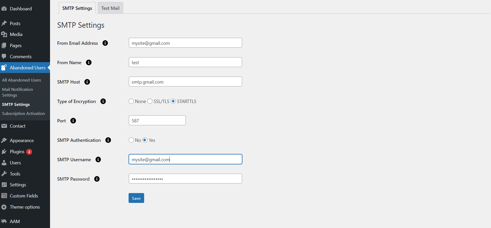

# Abandoned Contact Form 7
Abandoned Contact Form 7 plugin provides to track the Contact Form 7 form data even if the user does not submit the form. And, sends mail notification to each Abandoned user.

**Features of Abandoned Contact Form 7**
- Select your email ID field for Form in the form settings.
- Enable/Disable Option for multiple forms where you need in Contact Form 7.
- View the list of entries in the Admin side for Abandoned submission.
- In the list of Abandoned forms entry in admin side you can view IP addresses and other data which are filled-up by the user upto 10 Entries.
- Provision to send an email to a single user that abandoned the form.
- Facility to export the list of entire abandoned users upto 10 Entries.
- Also, An option to customize the mail body for Abandoned email upto 10 Entries.
- Select specific field to include in tracking data
- Compatibility of WordPress VIP.
  
[Learn more about the Pro version](https://store.zealousweb.com/abandoned-contact-form-7).

**Features of Abandoned Contact Form 7 Pro**

 We have released the PRO version of this plugin with extra advantageous features added. PRO Version 1.0 Released.
 
- In the list of Abandoned forms entry in admin side you can view IP addresses and other data which are filled-up by the user unlimited Entries.
- Facility to export the list of entire abandoned users unlimited Entries.
- You can schedule a time for sending emails to each abandoned user.
- You can set the “Status” of the user to send an email so we can manage not to send the same email again to the same user.
- You can easily manage the number of time emails sent to the user.
- Also, An option to customize the mail body for Abandoned email unlimited Entries.
- For schedule mails, we have the option of SMTP settings. Here, you can set SMTP from Plugin, no need to add another plugin for SMTP configuration.

# Installation
1. Download the plugin zip file from WordPress.org plugin site to your desktop / PC
2. If the file is downloaded as a zip archive, extract the plugin folder to your desktop.
3. With your FTP program, upload the plugin folder to the wp-content/plugins folder in your WordPress directory online
4. Go to the Plugin screen and find the newly uploaded Plugin in the list.
5. Click ‘Activate Plugin’ to activate it.

# How To Use

You have to configure it from wp-admin > Contact > Add/Edit Contact Forms (Contact Form 7 needs to be activated before) to use this plugin.

Click on ‘Contact” > “Edit Contact Form”, wherein you will find a new tab “Abandoned Form Settings” along with tabs of Form, Mail, Messages, Additional Settings. Here, you can adjust settings related to Abandoned Form and email fields and Select specific field to include in tracking data. 

On clicking “Abandoned Users’, you will see the list of abandoned user records who haven’t submitted the form.

Click on any of the Abandoned Users entries to view a respective user’s form details and man‐
age the mail notification settings.

Click on “Action” to send a manual email to that particular user. It will contain the email body with predefined body content and subject line (which you can edit).

In case you have enabled SMTP from “Mail Notification Settings,” you can manage the SMTP settings like username, password, and other details.

Also, under the same settings, you can test the mail to check if the SMTP detail is correct or not.

You can  manage the mail notification settings which are reflected in cron job schedule

- **Enable Abandoned**
 You can enable/disable Abandoned form functionality

- **Select Email Field**
 Select the email field for tracking an Abandoned user.

- **Mailer Type**
 You can change mailer type for emails to be sent.

- **Schedule Notification Time**
 You can select the scheduled notification time to send mail

- **Number of Email Notification**
 You can select the scheduled notification time to send mail.

- **Select Specific Field**
 Select specific field to include in tracking data.

# Getting Help

If you have any difficulties while using this Plugin, please feel free to contact us at opensource@zealousweb.com. We also offer custom WordPress extension development and WordPress theme design services to fulfill your e-commerce objectives. Our professional dy‐ namic WordPress experts provide profound and customer-oriented development of your project within short timeframes. Thank you for choosing a Plugin developed by ZealousWeb!
>>>>>>> 19b10dee14580a8ba01b012ccc6478c0dad2c1b4
